

  <a href="#-tecnologias">Tecnologias</a>&nbsp;&nbsp;&nbsp;|&nbsp;&nbsp;&nbsp;
  <a href="#-projeto">Projeto</a>&nbsp;&nbsp;&nbsp;|&nbsp;&nbsp;&nbsp;
  <a href="#-como-rodar">Como rodar</a>&nbsp;&nbsp;&nbsp;|&nbsp;&nbsp;&nbsp;
  <a href="#-como-contribuir">Como contribuir</a>&nbsp;&nbsp;&nbsp;
  

 

## Exercícios de PHP

## 🚀 Tecnologias

Esse projeto foi desenvolvido com as seguintes tecnologias:

- [PHP](https://www.php.net/) 
- [HTML5](https://developer.mozilla.org/pt-BR/docs/Web/HTML/HTML5) 
- [CSS3](https://developer.mozilla.org/pt-BR/docs/Web/CSS) 

## 💻 Projeto

Lista de alguns exercícios para aprendizado.

Site dos [exercícios](https://fit.faccat.br/~fpereira/apostilas/exerc_resp_alg_mar2007.pdf)

- Exercício 21:

Ler a hora de início e a hora de fim de um jogo de Xadrez (considerar apenas horas inteiras, sem os
minutos) e calcular a duração do jogo em horas, sabendo-se que o tempo máximo de duração do jogo é de 24 horas e que o jogo pode iniciar em um dia e terminar no dia seguinte. 

  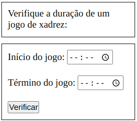

- Exercício 22:

A jornada de trabalho semanal de um funcionário é de 40 horas. O funcionário que trabalhar mais
de 40 horas receberá hora extra, cujo cálculo é o valor da hora regular com um acréscimo de 50%.
Escreva um algoritmo que leia o número de horas trabalhadas em um mês, o salário por hora e escreva
o salário total do funcionário, que deverá ser acrescido das horas extras, caso tenham sido trabalhadas
(considere que o mês possua 4 semanas exatas).

  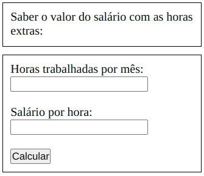

- Exercício 24:

Ler o salário fixo e o valor das vendas efetuadas pelo vendedor de uma empresa. Sabendo-se que
ele recebe uma comissão de 3% sobre o total das vendas até R$ 1.500,00 mais 5% sobre o que
ultrapassar este valor, calcular e escrever o seu salário total.

  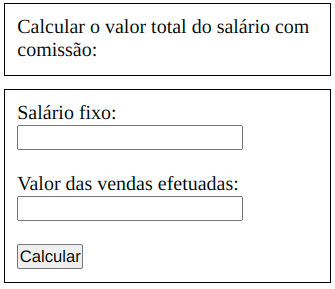

- Exercício 25:

Faça um algoritmo para ler: número da conta do cliente, saldo, débito e crédito. Após, calcular e
escrever o saldo atual (saldo atual = saldo - débito + crédito). Também testar se saldo atual for maior
ou igual a zero escrever a mensagem 'Saldo Positivo', senão escrever a mensagem 'Saldo Negativo'.

  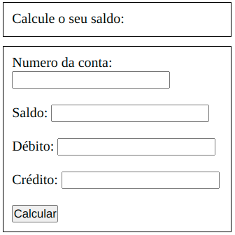

- Exercício 26:

Faça um algoritmo para ler: quantidade atual em estoque, quantidade máxima em estoque e
quantidade mínima em estoque de um produto. Calcular e escrever a quantidade média ((quantidade
média = quantidade máxima + quantidade mínima)/2). Se a quantidade atual em estoque for maior ou igual
a quantidade média escrever a mensagem 'Não efetuar compra', senão escrever a mensagem 'Efetuar
compra'.  

  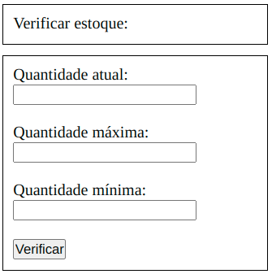

- Exercício 27:

Ler um valor e escrever se é positivo, negativo ou zero.

  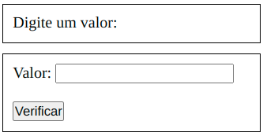

- Exercício 28:

Ler 3 valores (considere que não serão informados valores iguais) e escrever o maior deles.  

  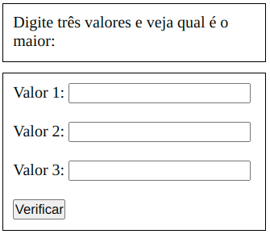

- Exercício 29:

Ler 3 valores (considere que não serão informados valores iguais) e escrever a soma dos 2
maiores.

  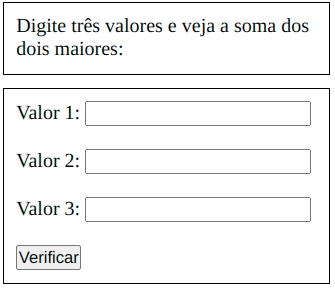

- Exercício 30:

Ler 3 valores (considere que não serão informados valores iguais) e escrevê-los em ordem
crescente.  

  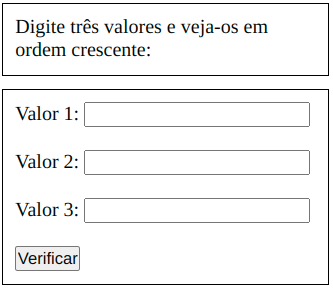

- Exercício 31:

Ler 3 valores (A, B e C) representando as medidas dos lados de um triângulo e escrever qual o tipo do triângulo que forma.   

  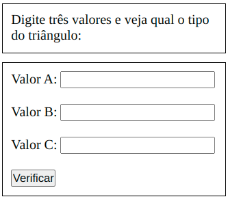

- Exercício 32:

Ler o nome de 2 times e o número de gols marcados na partida (para cada time). Escrever o nome
do vencedor. Caso não haja vencedor deverá ser impressa a palavra EMPATE.    

  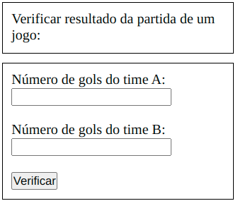

- Exercício 33:

Ler dois valores e imprimir na tela ‘Números iguais’, caso os números sejam iguais, 'O primeiro é maior’, caso o primeiro seja maior que o segundo ou 'O segundo é maior', caso o segundo seja maior que o primeiro. .  

  

- Exercício 35:

Um posto está vendendo combustíveis com a seguinte tabela de descontos:    

  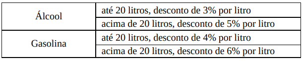

Escreva um algoritmo que leia o número de litros vendidos e o tipo de combustível (codificado da
seguinte forma: A-álcool, G-gasolina), calcule e imprima o valor a ser pago pelo cliente sabendo-se
que o preço do litro da gasolina é R$ 3,30 e o preço do litro do álcool é R$ 2,90.    

  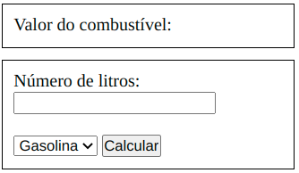

- Exercício 36:

Escreva um algoritmo que leia as idades de 2 homens e de 2 mulheres (considere que as idades
dos homens serão sempre diferentes entre si, bem como as das mulheres). Calcule e escreva a soma
das idades do homem mais velho com a mulher mais nova, e o produto das idades do homem mais
novo com a mulher mais velha.     

  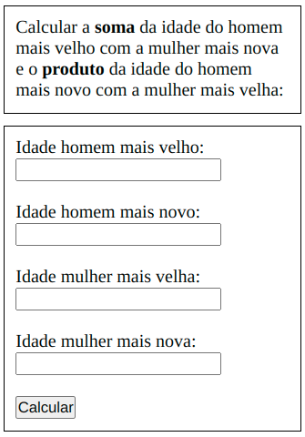

- Exercício 37:

Uma fruteira está vendendo frutas com a seguinte tabela de preços:

  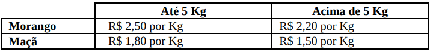

Se o cliente comprar mais de 8 Kg em frutas ou o valor total da compra ultrapassar R$ 25,00, receberá
ainda um desconto de 10% sobre este total. Escreva um algoritmo para ler a quantidade (em Kg) de
morangos e a quantidade (em Kg) de maças adquiridas e escreva o valor a ser pago pelo cliente. 

  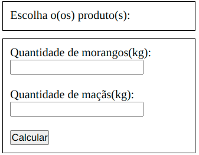

- Exercício 38:

Faça um algoritmo para ler um número que é um código de usuário. Caso este código seja
diferente de um código armazenado internamente no algoritmo (igual a 1234) deve ser apresentada a
mensagem ‘Usuário inválido!’. Caso o Código seja correto, deve ser lido outro valor que é a senha. Se
esta senha estiver incorreta (a certa é 9999) deve ser mostrada a mensagem ‘senha incorreta’. Caso a
senha esteja correta, deve ser mostrada a mensagem ‘Acesso permitido’.

  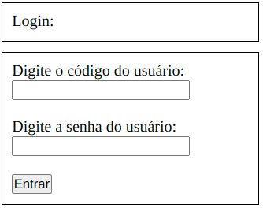

## 🚀 Como Rodar

- Clone o projeto.
- Entre no repositório e clice duas vezes no arquivo index.html

## 🤔 Como contribuir

- Faça um fork desse repositório;
- Cria uma branch com a sua feature: `git checkout -b minha-feature`;
- Faça commit das suas alterações: `git commit -m 'feat: Minha nova feature'`;
- Faça push para a sua branch: `git push origin minha-feature`.

Depois que o merge da sua pull request for feito, você pode deletar a sua branch.

## 📝 Licença

Esse projeto está sob a licença MIT.